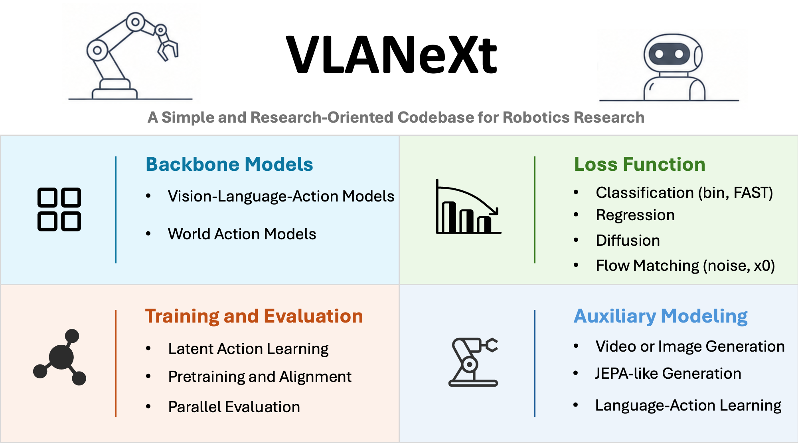

<p align="center">
  
</p>

# VLANeXt: A Simple and Research-Oriented Codebase for Robotics Research
[](https://arxiv.org/abs/2602.18532)
[](https://dravenalg.github.io/VLANeXt)
[](https://huggingface.co/DravenALG/VLANeXt)
[](https://github.com/DravenALG/awesome-vla-wam)


> 🚀 **Big Update!** Our codebase has received a major upgrade, bringing support for **World Action Models, Latent Action Pretraining and Fine-tuning, JEPA-like World Modeling, Smaller VLAs, Language-Action Learning**, and more. We have also added support for additional data formats and parallel evaluation. Plenty of new features are waiting for you to explore; check [TUTORIAL.md](./TUTORIAL.md)! We also keep the original code in the VLANeXt-ori branch to make it easy to reproduce the recipes explored in our paper.

> 🎉 **Good News!** Our paper has been accepted to **ICML 2026**!

<p align="center">
  
</p>

## 🛠️ Environment Setup

### Basic Installation
```bash
# Basic setup
conda create -n codebase python=3.10
# conda create -n codebase-plus python=3.10, for the LIBERO-plus benchmark
conda activate codebase
# conda activate codebase-plus
pip install torch==2.4.0 torchvision==0.19.0 torchaudio==2.4.0 --index-url https://download.pytorch.org/whl/cu124
pip install -r requirements.txt
pip install flash-attn --no-build-isolation
conda install -c conda-forge ffmpeg
```


### Benchmark Installation

**LIBERO**
```bash
cd /data/NTU_slab/draven/proj/third_party
git clone https://github.com/Lifelong-Robot-Learning/LIBERO.git
cd LIBERO && pip install .
```

**LIBERO-plus** (Separate environment needed)
```bash
cd /data/NTU_slab/draven/proj/third_party
git clone https://github.com/sylvestf/LIBERO-plus.git
cd LIBERO-plus && pip install .
# Dependencies
apt install libexpat1 libfontconfig1-dev libpython3-stdlib libmagickwand-dev
pip install -r extra_requirements.txt
conda env config vars set LIBERO_CONFIG_PATH=~/.libero_plus
```
You also need to download the assets; see [LIBERO-plus](https://github.com/sylvestf/LIBERO-plus).


## 🚀 Training
ONE [Config](config/libero_train_config.yaml), ONE [Training Code](scripts/train.py), and ONE [Model Code](src/models/VLANeXt.py) for ALL. See [TUTORIAL.md](./TUTORIAL.md) for a simple tutorial on how to configure each setting. Below is a brief introduction to the commands used.

### FAST Token Construction
**Run Training**:
```bash
python -m scripts.train_FAST --config config/libero_train_fast_config.yaml
```

Then you can train with FAST tokenizer by set `loss_type=classification` and `fast_action_tokenizer.enable=true` in training config.

### Latent Action Training
LAM first learns a latent-action encoder/decoder, then uses it to create a
LeRobot LIBERO copy whose `action` column stores latent actions.

```bash
# Single GPU
CUDA_VISIBLE_DEVICES=0 python -m scripts.train_lam --config config/libero_train_lam_config.yaml

# Multi-GPU
CUDA_VISIBLE_DEVICES=0,1,2,3,4,5,6,7 torchrun --standalone --nproc_per_node=8 scripts/train_lam.py --config config/libero_train_lam_config.yaml
```

Then generate latent-action data:
```bash
CUDA_VISIBLE_DEVICES=0 python scripts/generate_lam.py --checkpoint /data/NTU_slab/draven/checkpoints/codebase_lam/codebase_lam_libero_mixed_vae/checkpoint_final.pt --source-root /data/NTU_slab/draven/data/LIBERO_fastwam --output-root /data/NTU_slab/draven/data/LIBERO_fastwam_lam_vae --overwrite
```

After that, you can pretrain the model with latent action data by seting `data_root=/data/NTU_slab/draven/data/LIBERO_fastwam_lam` and `action_mode=latent`. After pretraining, finetune it using the following LIBERO Training commend.


### LIBERO Training
For more details, please refer to the [OpenVLA](https://github.com/openvla/openvla), which modifies the original dataset in LIBERO for training VLAs.

**Download**:
```bash
hf download openvla/modified_libero_rlds --repo-type dataset --local-dir LIBERO_modified
```

For the dataset in lerobot format, refer to the [FastWAM](https://github.com/yuantianyuan01/FastWAM.git).
**Download**:
```bash
hf download yuanty/LIBERO-fastwam --repo-type dataset --local-dir LIBERO_fastwam

# build frames to speed up training
python src/datasets/build_libero_lerobot_frame_cache.py /data/NTU_slab/draven/data/LIBERO_fastwam --resize-size 256
```

**Run Training**:
```bash
# Single GPU
CUDA_VISIBLE_DEVICES=0 python -m scripts.train --config config/libero_train_config.yaml

# Multi-GPU (Set distributed=true in config) (Enable DeepSpeed if using)
CUDA_VISIBLE_DEVICES=0,1,2,3,4,5,6,7 torchrun --standalone --nproc_per_node=8 -m scripts.train --config config/libero_train_config.yaml
```

### DROID Training
The official DROID dataset is in [DROID](https://droid-dataset.github.io). Here, we use a reorganize and filtterd DROID dataset proposed by [MolmoAct2](https://github.com/allenai/molmoact2).

**Download**:
```bash
hf download allenai/MolmoAct2-DROID-Dataset --repo-type dataset --local-dir MolmoAct2-DROID
```

**Run Training**:
```bash
# Single GPU
CUDA_VISIBLE_DEVICES=0 python -m scripts.train --config config/droid_train_config.yaml

# Multi-GPU (Set distributed=true in config) (Enable DeepSpeed if using)
CUDA_VISIBLE_DEVICES=0,1,2,3,4,5,6,7 torchrun --standalone --nproc_per_node=8 -m scripts.train --config config/droid_train_config.yaml
```


## 📊 Evaluation

### LIBERO Benchmark
For more details, please refer to the [official repository of LIBERO](https://github.com/Lifelong-Robot-Learning/LIBERO).

```bash
# setup environment variable
unset PYTHONPATH
export PYTHONPATH=$PYTHONPATH:/data/NTU_slab/draven/proj/third_party/LIBERO

CUDA_VISIBLE_DEVICES=0 MUJOCO_EGL_DEVICE_ID=0 python -m scripts.libero_bench_eval --config config/libero_bench_config.yaml
```

### LIBERO-plus Benchmark
For more details, please refer to the [official repository of LIBERO-plus](https://github.com/sylvestf/LIBERO-plus).

```bash
# setup environment variable
unset PYTHONPATH
export PYTHONPATH=$PYTHONPATH:/data/NTU_slab/draven/proj/third_party/LIBERO-plus

CUDA_VISIBLE_DEVICES=0 MUJOCO_EGL_DEVICE_ID=0 python -m scripts.libero_plus_bench_eval --config config/libero_plus_bench_config.yaml
```

## ❗ Common Issues
If you run into issues, check [COMMON_ISSUES.md](COMMON_ISSUES.md) for known problems and solutions.

## 📚 Citation

If you find VLANeXt useful for your research or applications, please cite our paper using the following BibTeX:

```bibtex
  @inproceedings{wu2026vlanext,
      title={VLANeXt: Recipes for Building Strong VLA Models}, 
      author={Xiao-Ming Wu and Bin Fan and Kang Liao and Jian-Jian Jiang and Runze Yang and Yihang Luo and Zhonghua Wu and Wei-Shi Zheng and Chen Change Loy},
      booktitle={ICML},
      year={2026},
  }
```

## 🗞️ License
This project is licensed under [NTU S-Lab License 1.0](LICENSE).
