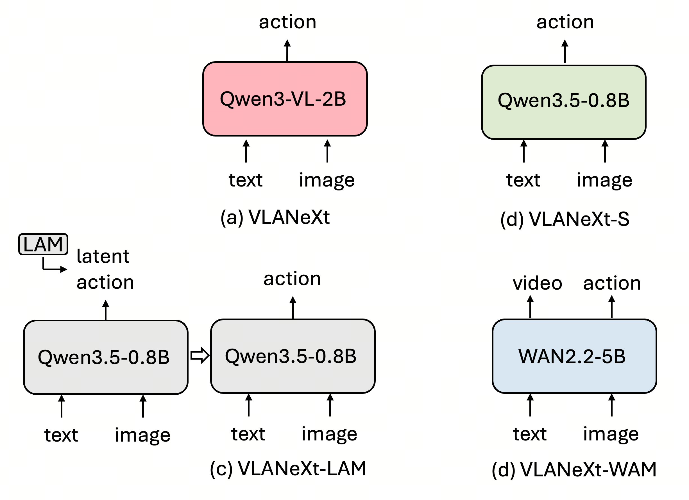

# VLANeXt Configuration Tutorial

Main files:

- Training config: `config/libero_train_config.yaml`
- Training script: `scripts/train.py`
- Model: `src/models/VLANeXt.py`
- Policy modules: `src/models/modules/policies.py`
- Dataset loaders: `src/datasets/libero_act.py`, `src/datasets/libero_lerobot_act.py`, `src/datasets/droid_lerobot_act.py`
- Evaluation configs: `config/libero_bench_config.yaml`, `config/libero_plus_bench_config.yaml`
- Evaluation scripts: `scripts/libero_bench_eval.py`, `scripts/libero_plus_bench_eval.py`
- Evaluation helper: `src/evaluation/libero_bench/VLANeXt_utils.py`

<p align="center">
  
</p>

## Table of Contents

We use ⭐️ for the important design choices, others are some engineering parameters

- [1. Model](#1-model)
  - [1.1 Backbone ⭐️](#11-backbone)
  - [1.2 Backbone-Policy Connection ⭐️](#12-backbone-policy-connection)
  - [1.3 Policy Architecture](#13-policy-architecture)
  - [1.4 Proprioception and Action Inputs ⭐️](#14-proprioception-and-action-inputs)
- [2. Data](#2-data)
  - [2.1 Dataset Type](#21-dataset-type)
  - [2.2 Sampling Strategy](#22-sampling-strategy)
  - [2.3 Vision Inputs ⭐️](#23-vision-inputs)
  - [2.4 Data Augmentation](#24-data-augmentation)
  - [2.5 Data Loader](#25-data-loader)
- [3. Training](#3-training)
  - [3.1 Project, Logging, and Checkpoints](#31-project-logging-and-checkpoints)
  - [3.2 Optimizer and Scheduler](#32-optimizer-and-scheduler)
  - [3.3 DeepSpeed](#33-deepspeed)
  - [3.4 EMA](#34-ema)
  - [3.5 Alignment Stage ⭐️](#35-alignment-stage)
  - [3.6 Size and Speed Evaluation](#36-size-and-speed-evaluation)
  - [3.7 Latent Action Workflow ⭐️](#37-latent-action-workflow)
- [4. Loss Functions](#4-loss-functions)
  - [4.1 Main Action Loss ⭐️](#41-main-action-loss)
  - [4.2 FAST Tokenizer Construction ⭐️](#42-fast-tokenizer-construction)
  - [4.3 Future Video Generation Loss ⭐️](#43-future-video-generation-loss)
  - [4.4 Future Image Generation Loss ⭐️](#44-future-image-generation-loss)
  - [4.5 DCT Loss ⭐️](#45-dct-loss)
  - [4.6 Language-Action Loss ⭐️](#46-language-action-loss)
- [5. Evaluation](#5-evaluation)
  - [5.1 Eval Config: Checkpoint and Inference Override](#51-eval-config-checkpoint-and-inference-override)
  - [5.2 Eval Config: Rollout Settings](#52-eval-config-rollout-settings)
  - [5.3 Eval Config: Image Preprocessing](#53-eval-config-image-preprocessing)

## 1. Model

### 1.1 Backbone

#### Parameters

- `model.lmm_path`: selects the backbone family.
  - Qwen / Qwen-VL examples: `Qwen/Qwen3.5-0.8B`, `Qwen/Qwen3-VL-2B-Instruct`.
  - PaliGemma example: `google/paligemma-3b-pt-224`.
  - Llama example: `meta-llama/Llama-3.2-3B`.
  - WAN video-generation example: `Wan-AI/Wan2.2-TI2V-5B`.
- `model.vision_encoder_path`: SigLIP vision encoder path for Llama-based VLMs. Use `google/siglip2-base-patch16-256` as the default.
- `model.use_pretrained_backbone`: if `true`, loads pretrained backbone weights; if `false`, initializes the backbone from config.
- `model.backbone_mode`: `finetune` trains the backbone; `frozen` freezes it. Full fine-tuning is recommended for best performance.
- `model.train_text_embedding`: training choice for the text embedding. `true` trains it, `false` freezes it, `null` follows `backbone_mode`.
- `model.train_vision_encoder`: training choice for the vision encoder. `true` trains it, `false` freezes it, `null` follows `backbone_mode`.
- `model.gradient_checkpointing`: enables activation checkpointing to reduce memory usage.

#### Example from current config

The current config uses a small Qwen backbone, loads pretrained weights, and fine-tunes it.

```yaml
model:
  lmm_path: "Qwen/Qwen3.5-0.8B"
  vision_encoder_path: "google/siglip2-base-patch16-256"
  use_pretrained_backbone: true
  backbone_mode: "finetune"
  train_text_embedding: true
  train_vision_encoder: true
  gradient_checkpointing: true
```

### 1.2 Backbone-Policy Connection

#### Parameters

- `model.condition_type`: chooses how the backbone features condition the policy.
  - `loose`: appends learnable meta queries to the VLM, sends query outputs through `connector`, then gives the pooled connector feature to a MetaQuery policy.
  - `tight`: does not append meta queries. The policy cross-attends directly to the VLM hidden states.
  - `soft`: appends meta queries like `loose`, but uses the hidden-state MoE policy like `tight`.
- `model.num_queries`: number of learnable meta-query tokens used by `loose` and `soft`.
- `model.use_transformer_connector`: for `loose`, use `ConnectorTransformer` when `true`; otherwise use a small MLP connector.
- `model.connector_depth`: number of Transformer layers in the loose connector.
- `model.connector_num_heads`: number of attention heads in the loose connector.

WAN only supports `condition_type: tight`.

#### Example from current config

The current config uses `soft`: it adds meta queries to the backbone input, then conditions the policy with VLM hidden states.

```yaml
model:
  condition_type: "soft"
  num_queries: 16
  use_transformer_connector: true
  connector_depth: 2
  connector_num_heads: 4
```

### 1.3 Policy Architecture

#### Parameters

- `model.action_dim`: action dimension predicted at each future step. LIBERO and Droid real actions use `7`; latent actions should match the LAM `latent_dim`. Normally, keeping the same LAM dimension avoids changing the VLA action head.
- `data.future_len`: number of future actions predicted per model call.
- `data.history_len`: number of historical proprio/action/video steps available to the model.
- `model.policy_hidden_size`: hidden width of the action policy Transformer.
- `model.policy_depth`: number of policy Transformer blocks.
- `model.policy_num_heads`: number of attention heads in the policy.
- `model.policy_mlp_ratio`: MLP expansion ratio inside policy blocks.

The actual policy class is selected by `model.loss_type` and `model.condition_type`:

- `diffusion + loose`: `ActionDiffusionTransformerMetaquery`.
- `diffusion + tight/soft`: `ActionDiffusionTransformerMoE`.
- `regression + loose`: `ActionRegressionTransformerMetaquery`.
- `regression + tight/soft`: `ActionRegressionTransformerMoE`.
- `classification + loose`: `ActionClassificationTransformerMetaquery`, or `ActionClassificationTransformerMetaqueryAutoregressive` when `classification_type` is `autoregressive`.
- `classification + tight/soft`: `ActionClassificationTransformerMoE`, or `ActionClassificationTransformerMoEAutoregressive` when `classification_type` is `autoregressive`.

#### Example from current config

The current config predicts an 8-step chunk of 7D actions with a 24-layer policy.

```yaml
data:
  history_len: 8
  future_len: 8
model:
  action_dim: 7
  policy_hidden_size: 1024
  policy_depth: 24
  policy_num_heads: 16
  policy_mlp_ratio: 4.0
```

### 1.4 Proprioception and Action Inputs

#### Parameters

- `model.use_proprio_input_vlm`: when `true`, the dataset emits proprioception history and the model prepends projected proprio tokens to the VLM input.
- `model.use_transformer_proprio_projector`: when `true`, uses `ActionTransformerProjector` for proprio tokens; when `false`, uses a linear projector.
- `model.projector_depth`: Transformer depth for the proprio projector.
- `model.projector_num_heads`: attention heads for the proprio projector.
- `model.use_action_input_policy`: when `true`, the dataset emits previous actions and the action policy receives them as extra history tokens.
- `data.history_len`: controls the number of proprio/history-action tokens.


#### Example from current config

The current config feeds proprioception to the VLM with a linear projector, but does not feed previous actions to the policy.

```yaml
data:
  history_len: 8
model:
  use_proprio_input_vlm: true
  use_transformer_proprio_projector: false
  projector_depth: 2
  projector_num_heads: 4
  use_action_input_policy: false
```


## 2. Data

### 2.1 Dataset Type

#### Parameters

- `data.dataset_name`: dataset family. Supported by `scripts/train.py`: `libero`, `droid`, and `real`.
- `data.dataset_format`: storage format. LIBERO supports `tfds` and `lerobot`; Droid supports `lerobot`.
- `data.data_root`: dataset root path.
- `data.action_mode`: action target type.
  - LIBERO LeRobot: `libero` for 7D normalized LIBERO actions, `latent` for LAM-generated latent actions.
  - Droid: usually `droid`.
- `data.task_suite_name`: task suite or dataset split name.
  - LIBERO options include `libero_spatial`, `libero_object`, `libero_goal`, `libero_10`, `libero_mixed`.
- `data.normalization_suite_name`: action statistics used for normalization. If empty, it follows `task_suite_name`.
- `model.action_dim`: must match the action target dimension emitted by the dataset.


#### Example from current config

The current config trains on mixed LIBERO in LeRobot format with real 7D LIBERO actions.

```yaml
data:
  dataset_name: "libero"
  dataset_format: "lerobot"
  data_root: "/data/NTU_slab/draven/data/LIBERO_fastwam"
  action_mode: "libero"
  task_suite_name: "libero_mixed"
  normalization_suite_name: "libero_mixed"
model:
  action_dim: 7
```

### 2.2 Sampling Strategy

#### Parameters

- `data.full_sequence`: if `true`, sample every valid timestep; if `false`, randomly subsample each trajectory.
- `data.sampling_rate`: fraction of valid timesteps sampled when `full_sequence=false`.
- `data.history_len`: number of historical timesteps for video, proprioception, and previous actions.
- `data.future_len`: number of future actions in each target chunk.
- `data.future_video_downsample`: for WAN future-video targets, sample future frames every N action steps.
- `data.allow_end_padding`: if `true`, include samples near episode end and pad missing future actions/images/videos.


#### Example from current config

The current config samples 10% of timesteps and predicts 8-step action chunks.

```yaml
data:
  full_sequence: false
  sampling_rate: 0.1
  history_len: 8
  future_len: 8
  future_video_downsample: 1
  allow_end_padding: true
```

### 2.3 Vision Inputs

#### Parameters

- `data.input_modality`: `image` uses the current frame; `video` uses `history_len` frames.
- `data.image_resize_size`: resize before augmentation/processor. Use an integer for square resize, `[height, width]` for rectangular resize, or `null` to keep raw size.
- `data.view_mode`: `single` uses main camera only; `multi` uses main + wrist camera.
- `data.bimanual`: if `true`, collator expects a third camera when available.

Backbone notes:

- Qwen can be used with `image` or `video` paths in this codebase.
- PaliGemma and Llama should use `image`.
- WAN uses current image conditioning and future video targets internally.

#### Example from current config

The current config uses single-frame visual input with main + wrist cameras resized to 256.

```yaml
data:
  input_modality: "image"
  image_resize_size: 256
  view_mode: "multi"
  bimanual: false
```

### 2.4 Data Augmentation

#### Parameters

- `data.augmentation.enabled`: master switch for image/video augmentation.
- `data.augmentation.random_resized_crop.scale`: crop area range.
- `data.augmentation.random_resized_crop.ratio`: crop aspect-ratio range.
- `data.augmentation.random_brightness`: brightness jitter. One value means symmetric range around `1.0`; two values mean explicit range.
- `data.augmentation.random_contrast`: contrast jitter.
- `data.augmentation.random_saturation`: saturation jitter.
- `data.augmentation.random_hue`: hue jitter.
- `data.augmentation.augment_order`: ordered list of augmentation operations.

The collator samples one set of augmentation parameters and applies it consistently across frames/views in a sample.

Backbone note:

- When using WAN future-video generation loss (`model.video_generation_loss_weight > 0`), disable data augmentation by setting `data.augmentation.enabled: false`. Augmented visual inputs/targets make future-video prediction harder to learn.

#### Example from current config

The current config enables crop and several jitters.

```yaml
data:
  augmentation:
    enabled: true
    random_resized_crop:
      scale: [0.8, 1.0]
      ratio: [0.9, 1.1]
    random_brightness: [0.2]
    random_contrast: [0.8, 1.2]
    random_saturation: [0.8, 1.2]
    random_hue: [0.05]
    augment_order:
      - "random_resized_crop"
      - "random_brightness"
      - "random_contrast"
      - "random_saturation"
      - "random_hue"
```

### 2.5 Data Loader

#### Parameters

- `data.buffer_size`: shuffle buffer size for streaming-style loaders. For LeRobot loaders, records are also shuffled by epoch.
- `data.batch_size`: total effective batch size across all GPUs and gradient accumulation steps.
- `data.max_steps`: number of optimizer steps for main training.
- `data.num_workers`: PyTorch DataLoader workers.
- `data.pin_memory`: use pinned CPU memory for faster GPU transfer.
- `data.persistent_workers`: keep workers alive between epochs when `num_workers > 0`.
- `data.prefetch_factor`: number of batches prefetched per worker when `num_workers > 0`.
- `data.drop_last`: drop incomplete final batches. This is recommended for stable training.

The trainer computes:

```text
per_device_batch_size = data.batch_size / (world_size * train.gradient_accumulation_steps)
```

LeRobot LIBERO and Droid datasets emit prebatched samples internally, so the outer DataLoader uses `batch_size=None`.

#### Example from current config

The current config uses total batch size 256 and trains for 30k optimizer steps.

```yaml
data:
  buffer_size: 1000
  batch_size: 256
  max_steps: 30000
  num_workers: 1
  pin_memory: true
  persistent_workers: true
  prefetch_factor: 4
  drop_last: true
```

## 3. Training

### 3.1 Project, Logging, and Checkpoints

#### Parameters

- `project.name`: experiment name. The trainer splits names with more than three underscore-separated parts into parent/sub directories.
- `project.output_dir`: root checkpoint/log directory.
- `project.log_interval`: log every N optimizer steps.
- `project.save_interval`: save every N optimizer steps.
- `project.use_wandb`: enable Weights & Biases logging on rank 0.
- Optional `project.wandb_project`: override W&B project name.
- Optional `project.wandb_entity`: W&B entity.

#### Example from current config

```yaml
project:
  name: "codebase_v2_libero_mixed_steps30k_lerobot_distributed"
  output_dir: "/data/NTU_slab/draven/checkpoints/codebase"
  log_interval: 10
  save_interval: 20000
  use_wandb: true
```

### 3.2 Optimizer and Scheduler

#### Parameters

- `train.seed`: random seed for Python, NumPy, and PyTorch.
- `train.resume_path`: full checkpoint resume path. Loads model, optimizer, scheduler, and step.
- `train.pretrained_checkpoint`: weight-only initialization for a new run.
- `train.pretrained_ignore_mismatched_shapes`: skip checkpoint tensors whose shapes do not match the current model. Useful when moving from latent-action action dimensions to real-action dimensions.
- `train.learning_rate`: AdamW learning rate.
- `train.scheduler`: `cosine_decay`, `linear_decay`, or `fixed`.
- `train.weight_decay`: AdamW weight decay.
- `train.warmup_steps`: LR warmup steps.
- `train.gradient_accumulation_steps`: number of microbatches per optimizer step.
- `train.max_grad_norm`: gradient clipping norm. Set `<=0` to disable clipping.
- `train.device`: device for non-distributed training.
- `train.distributed`: enable distributed training.
- `train.dist_backend`: distributed backend, usually `nccl`.

#### Example from current config

```yaml
train:
  seed: 42
  resume_path: ""
  pretrained_checkpoint: ""
  pretrained_ignore_mismatched_shapes: false
  learning_rate: 1.0e-4
  scheduler: "cosine_decay"
  weight_decay: 0.1
  warmup_steps: 1500
  gradient_accumulation_steps: 1
  max_grad_norm: 1.0
  device: "cuda"
  distributed: true
  dist_backend: "nccl"
```

### 3.3 DeepSpeed

#### Parameters

- `train.deepspeed.enabled`: use DeepSpeed instead of plain DDP.
- `train.deepspeed.zero_stage`: ZeRO stage, usually `0`, `1`, `2`, or `3`.
- `train.deepspeed.offload_optimizer_device`: optimizer offload target: `none`, `cpu`, or `nvme`.
- `train.deepspeed.offload_param_device`: parameter offload target for ZeRO-3: `none`, `cpu`, or `nvme`.
- `train.deepspeed.reduce_bucket_size`: reduce bucket size.
- `train.deepspeed.allgather_bucket_size`: all-gather bucket size.
- `train.deepspeed.partition_activations`: DeepSpeed activation checkpoint partitioning.
- `train.deepspeed.cpu_checkpointing`: offload activation checkpoints to CPU.

#### Example from current config

```yaml
train:
  deepspeed:
    enabled: true
    zero_stage: 1
    offload_optimizer_device: "none"
    offload_param_device: "none"
    reduce_bucket_size: 5.0e8
    allgather_bucket_size: 5.0e8
    partition_activations: false
    cpu_checkpointing: false
```

### 3.4 EMA

#### Parameters

- `train.ema.enabled`: enable exponential moving average checkpoints. EMA checkpoints can be more stable for benchmark evaluation.
- `train.ema.ema_weight`: old EMA weight. Current model contributes `1 - ema_weight`.
- `train.ema.save_interval`: EMA update/save interval in optimizer steps.

EMA single-file saving is not supported with DeepSpeed ZeRO-3 in this trainer.

#### Example from current config

EMA is disabled in the current config.

```yaml
train:
  ema:
    enabled: false
    ema_weight: 0.999
    save_interval: 5
```

### 3.5 Alignment Stage

#### Parameters

`train.train_alignment` runs before the main fine-tuning stage when enabled. It is skipped during full resume.

- `train.train_alignment.enabled`: enable alignment stage.
- `train.train_alignment.learning_rate`: alignment-stage LR.
- `train.train_alignment.alignment_steps`: number of alignment optimizer steps.
- `train.train_alignment.warmup_steps`: alignment LR warmup steps.
- `train.train_alignment.train_action_modules`: train the action projector and policy output side.
- `train.train_alignment.train_full_policy`: when `true`, train the full action policy; when `false`, train only `action_head.final_layer`.
- `train.train_alignment.reinit_action_modules`: reinitialize the action projector and action final layer before alignment.
- `train.train_alignment.train_text_embedding`: also train VLM text embeddings during alignment.
- `train.train_alignment.train_vision_encoder`: also train the vision encoder during alignment.

Alignment is most useful with `train.pretrained_checkpoint`.

#### Example from current config

The current config defines alignment hyperparameters but disables the stage.

```yaml
train:
  pretrained_checkpoint: ""
  train_alignment:
    enabled: false
    learning_rate: 1.0e-4
    alignment_steps: 600
    warmup_steps: 60
    train_action_modules: true
    train_full_policy: false
    reinit_action_modules: false
    train_text_embedding: false
    train_vision_encoder: false
```

### 3.6 Size and Speed Evaluation

#### Parameters

- `size_speed_eval.enabled`: run size/speed benchmark inside `scripts/train.py`.
- `size_speed_eval.exit_after_eval`: exit after benchmark instead of training.
- `size_speed_eval.batch_size`: benchmark batch size.
- `size_speed_eval.num_warmup`: warmup iterations.
- `size_speed_eval.num_runs`: timed iterations.

#### Example from current config

```yaml
size_speed_eval:
  enabled: false
  exit_after_eval: false
  batch_size: 1
  num_warmup: 5
  num_runs: 50
```

### 3.7 Latent Action Workflow

#### Parameters

The latent-action pipeline has three stages.

Stage 1: train the Latent Action Model with `scripts/train_lam.py`.

- LAM config file: `config/libero_train_lam_config.yaml`.
- Important LAM model parameters: `model.lam_type`, `model.latent_dim`, `model.hidden_size`, `model.recon_l1_weight`, `model.recon_mse_weight`.
- VAE-specific: `model.kl_weight`.
- VQ-specific: `model.codebook_size`, `model.commitment_weight`, `model.vq_weight`.
- VICReg-specific: `model.vicreg_invariance_weight`, `model.vicreg_variance_weight`, `model.vicreg_covariance_weight`, `model.min_std`.

Stage 2: generate latent actions with `scripts/generate_lam.py`.

- `--checkpoint`: trained LAM checkpoint.
- `--source-root`: original LeRobot dataset root.
- `--output-root`: copied/converted latent-action dataset root.
- `--overwrite`: replace existing output root when available.
- `--view-mode`, `--image-resize-size`, `--batch-size`, `--suites`, `--max-episodes`: optional conversion controls.

Stage 3: train VLA on latent actions, then fine-tune on real actions.

- `data.action_mode`: use `latent` for latent pretraining and `libero` for real-action fine-tuning.
- `data.data_root`: point to latent dataset root for latent pretraining, then original dataset root for real fine-tuning.
- `model.action_dim`: match LAM `latent_dim` during latent pretraining, then use `7` for LIBERO real actions.
- `train.pretrained_checkpoint`: load latent-pretrained VLA for real-action fine-tuning.
- `train.pretrained_ignore_mismatched_shapes`: set `true` if latent and real action dimensions differ.

#### Example from current config

To switch the current config to latent-action pretraining:

```yaml
data:
  data_root: "/data/NTU_slab/draven/data/LIBERO_fastwam_lam"
  action_mode: "latent"
model:
  action_dim: 7  # set to LAM latent_dim
```

To fine-tune back on real LIBERO actions:

```yaml
data:
  data_root: "/data/NTU_slab/draven/data/LIBERO_fastwam"
  action_mode: "libero"
model:
  action_dim: 7
train:
  pretrained_checkpoint: "/path/to/latent_vla/checkpoint_final.pt"
```

## 4. Loss Functions

### 4.1 Main Action Loss

#### Parameters

- `model.loss_type`: main action objective.
  - `diffusion`: denoising / flow-matching action generation.
  - `regression`: direct MSE action regression.
  - `classification`: discretized action-token classification.
- `model.num_train_timesteps`: number of training timesteps for diffusion/flow.
- `model.num_inference_timesteps`: default number of inference denoising steps saved in the checkpoint.
- `model.scheduler_type`: `ddim` or `flow_match` for training. Eval config may also override this.
- `model.diffusion_loss_domain`: `noise` or `x0`.
  - DDIM + `noise`: predict epsilon.
  - DDIM + `x0`: predict clean action.
  - Flow matching + `noise`: predict velocity `noise - x0`.
  - Flow matching + `x0`: predict clean action.
- `model.classification_type`: for classification, `parallel` predicts all action tokens at once; `autoregressive` predicts autoregressively.
- `model.num_bins`: number of bins for pose dimensions in bin classification. Gripper uses 2 bins.
- `model.fast_action_tokenizer.enabled`: use FAST action tokenizer instead of per-dimension bins.
- `model.fast_action_tokenizer.expected_seq_len`: FAST token sequence length, including EOS slot.
- `model.fast_action_tokenizer.tokenizer_path`: saved FAST tokenizer directory.

#### Example from current config

The current config uses diffusion with flow matching and trains in velocity/noise space. Classification and FAST settings are present but inactive.

```yaml
model:
  loss_type: "diffusion"
  num_train_timesteps: 1000
  num_inference_timesteps: 10
  scheduler_type: "flow_match"
  diffusion_loss_domain: "noise"
  classification_type: autoregressive
  num_bins: 256
  fast_action_tokenizer:
    enabled: false
    expected_seq_len: 48
    tokenizer_path: "src/models/fast_tokenizer/libero_mixed"
```

### 4.2 FAST Tokenizer Construction

#### Parameters

FAST tokenizer training is configured in `config/libero_train_fast_config.yaml`, then referenced by `model.fast_action_tokenizer` in the VLA training config.

The configs for `config/libero_train_fast_config.yaml` are:

- `data.data_root`: TFDS LIBERO root for FAST construction.
- `data.version`: TFDS version directory, usually `1.0.0`.
- `data.task_suite_name`: suite used to collect action chunks.
- `data.normalization_suite_name`: action stats used before tokenization.
- `data.future_len`: action chunk length; should match VLA `data.future_len`.
- `model.action_dim`: action dimension.
- `fast.output_dir`: tokenizer save directory.
- `fast.max_trajs`: optional trajectory cap.
- `fast.scale`: DCT coefficient scaling before BPE.
- `fast.vocab_size`: BPE vocabulary size.

#### Example from current config

To use FAST classification for training, change the current training config to:

```yaml
model:
  loss_type: "classification"
  classification_type: "autoregressive"
  fast_action_tokenizer:
    enabled: true
    expected_seq_len: 48
    tokenizer_path: "src/models/fast_tokenizer/libero_mixed"
```

### 4.3 Future Video Generation Loss

#### Parameters

These parameters are active only when `model.lmm_path` contains `wan`.

- `model.video_generation_loss_weight`: weight for WAN future-video generation loss. If enable, simply using 1.0 is OK.
- `model.wan_action_condition_mode`: `fast` conditions action on first-frame video tokens; `joint` conditions action on first-frame and future-video tokens together.
- `model.wan_tokenizer_model_id`: text tokenizer/encoder model ID used by WAN. The common choice is `google/umt5-xxl`.
- `model.wan_prompt_template`: prompt template. It can use `{instruction}` and `{task}`.
- `data.future_video_downsample`: temporal downsampling for future video targets. WAN expects `future_len / future_video_downsample + 1` frames including the current frame, and the resulting frame count must satisfy `T % 4 == 1`.

When enabling video generation loss, disable visual data augmentation. Future-video generation needs temporally consistent visual targets, while crop/color jitter makes the objective harder to learn.

WAN constraints:

```yaml
data:
  augmentation:
    enabled: false
model:
  loss_type: "diffusion"
  scheduler_type: "flow_match"
  condition_type: "tight"
```

#### Example from current config

The current config keeps WAN parameters ready, but they are inactive because `lmm_path` is Qwen.

```yaml
data:
  future_len: 8
  future_video_downsample: 1
model:
  lmm_path: "Qwen/Qwen3.5-0.8B"
  video_generation_loss_weight: 1.0
  wan_action_condition_mode: "fast"
  wan_flow_shift: 5.0
  wan_text_len: 512
  wan_tokenizer_model_id: "google/umt5-xxl"
  wan_prompt_template: "A video recorded from a robot's point of view executing the instruction: {instruction}"
```

### 4.4 Future Image Generation Loss

#### Parameters

- `model.future_image_loss_weight`: enables future-image/world-modeling loss when `> 0`. If enable, simply using 1.0 is OK.
- `model.future_image_prediction_type`: `emu_token` or `dinov3_flow`.
  - `emu_token`: predicts Emu vision-token IDs with cross entropy.
  - `dinov3_flow`: predicts DINOv3 patch features with flow matching.
- `model.future_image_mode`: target image selection, `horizon` for `t + future_len`, `goal` for final frame in the episode.
- `model.future_image_dino_model_path`: DINOv3 model path for `dinov3_flow`. Use `facebook/dinov3-vitb16-pretrain-lvd1689m` by default.
- `model.future_image_dino_image_size`: DINO input image size.
- `model.future_image_flow_num_inference_timesteps`: inference steps for future-image feature flow. This is only used with `dinov3_flow`.
- `model.generator_hidden_size`: future-image generator hidden width.
- `model.generator_depth`: generator depth.
- `model.generator_num_heads`: generator attention heads.
- `model.generator_mlp_ratio`: generator MLP ratio.
- `model.generator_max_seq_len`: maximum generated token/feature length.
- `model.future_image_num_tokens`: number of Emu image tokens to generate at inference.

If enabled, the dataset automatically loads `future_image`.

#### Example from current config

The current config disables this auxiliary loss with weight `0.0`, but keeps the DINOv3-flow settings ready.

```yaml
model:
  future_image_loss_weight: 0.0
  future_image_prediction_type: "dinov3_flow"
  future_image_mode: "horizon"
  future_image_dino_model_path: "facebook/dinov3-vitb16-pretrain-lvd1689m"
  future_image_dino_image_size: 256
  future_image_flow_num_inference_timesteps: 10
  generator_hidden_size: 768
  generator_depth: 24
  generator_num_heads: 12
  generator_mlp_ratio: 4.0
  generator_max_seq_len: 1024
  future_image_num_tokens: 256
```

### 4.5 DCT Loss

#### Parameters

- `model.dct_loss_weight`: enables DCT loss when `> 0`. If enable, simply using 0.1 is OK.
- `model.dct_freq_split`: fraction of the temporal frequency axis treated as low frequency.
- `model.dct_low_freq_weight`: weight for low-frequency DCT coefficients.
- `model.dct_high_freq_weight`: weight for high-frequency DCT coefficients.
- `model.dct_similarity_type`: `mse`, `mae`, or `cosine`.

#### Example from current config

The current config enables low-frequency DCT smoothing and ignores high-frequency terms.

```yaml
model:
  dct_loss_weight: 0.1
  dct_freq_split: 0.125
  dct_low_freq_weight: 5.0
  dct_high_freq_weight: 0.0
  dct_similarity_type: "mse"
```

### 4.6 Language-Action Loss

#### Parameters

- `model.language_action_loss_weight`: enables auxiliary language-action supervision when `> 0`. If enable, simply using 1.0 is OK.
- `model.policy_gradient_stop_for_vlm`: when `true`, stops action-policy gradients from flowing into the VLM hidden states.
- `model.language_action_format`: `vla-0`, `lap`.
  - `vla-0`: outputs integer tokens in normalized action space.
  - `lap`: outputs language-style action summaries in robot/base frame.
- `model.language_action_num_bins`: number of bins for `vla-0` text formatting.
- `model.language_action_max_new_tokens`: maximum generated text tokens at inference.

LAP is implemented for LIBERO and Droid. WAN disables language-action loss.

#### Example from current config

The current config disables language-action loss, but keeps LAP formatting settings.

```yaml
model:
  language_action_loss_weight: 0.0
  policy_gradient_stop_for_vlm: false
  language_action_format: "lap"
  language_action_num_bins: 1000
  language_action_max_new_tokens: 256
```

## 5. Evaluation

### 5.1 Eval Config: Checkpoint and Inference Override

#### Parameters

These are in `config/libero_bench_config.yaml` or `config/libero_plus_bench_config.yaml`.

- `eval.finetuned_checkpoint`: checkpoint file or DeepSpeed checkpoint directory.
- `model.diffusion_steps`: overrides `model.num_inference_timesteps` for diffusion policies at evaluation time.
- `model.scheduler_type`: optional scheduler override at eval time.
- `project.use_wandb`: enable/disable W&B logging for evaluation.

#### Example from current eval config

```yaml
model:
  diffusion_steps: 5
  scheduler_type: "flow_match"

project:
  use_wandb: false

eval:
  finetuned_checkpoint: "/data/NTU_slab/draven/checkpoints/codebase/codebase_v2_libero/mixed_steps30k_dino_image_generation_lerobot_distributed/checkpoint_final.pt"
```

### 5.2 Eval Config: Rollout Settings

#### Parameters

- `eval.task_suite_name`: LIBERO/LIBERO-plus benchmark suite to evaluate.
- `eval.num_steps_wait`: number of initial no-op/wait steps before querying the policy.
- `eval.num_steps_execute`: number of actions executed from each predicted chunk.
- `eval.num_parallel_envs`: number of parallel simulation environments.
- `eval.num_trials_per_task`: number of testing episodes per task.
- `eval.seed`: eval random seed.
- `eval.image_size`: simulator render size and model resize size.
- `eval.resume_episodes`: number of already-completed episodes when resuming evaluation.
- `eval.resume_successes`: successes among those completed episodes (for resume use).

The rollout code predicts an action chunk, executes up to `num_steps_execute` actions, then queries the model again when the buffer is empty.

#### Example from current eval config

```yaml
eval:
  task_suite_name: "libero_spatial"
  num_steps_wait: 10
  num_steps_execute: 8
  num_parallel_envs: 32
  num_trials_per_task: 50
  seed: 42
  image_size: 256
  resume_episodes: 0
  resume_successes: 0
```

### 5.3 Eval Config: Image Preprocessing

#### Parameters

- `data.augmentation.center_crop`: apply eval-time center crop before resize. This is useful when training used data augmentation.
- `data.augmentation.center_crop_ratio`: crop ratio relative to the shorter side.


#### Example from current eval config

```yaml
data:
  augmentation:
    center_crop: true
    center_crop_ratio: 0.9
```
